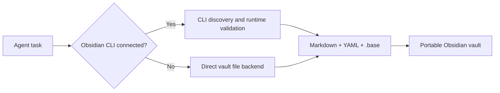

<p align="center">
  <picture>
    <source media="(prefers-color-scheme: dark)" srcset="./assets/official/obsidian-logo-text-white-purple.svg">
    <source media="(prefers-color-scheme: light)" srcset="./assets/official/obsidian-logo-text-black.svg">
    
  </picture>
</p>

<h1 align="center">Obsidian Knowledge Manager</h1>

<p align="center">
  A Codex skill for reliable Obsidian knowledge-base automation—with the desktop CLI when available, and directly on Markdown, YAML, and <code>.base</code> files when it is not.
</p>

<p align="center">
  
  
  
  
</p>

> [!NOTE]
> This is an independent community project. It is not affiliated with or endorsed by Obsidian. The Obsidian name and logo are trademarks of Obsidian; the official logo above is displayed unmodified according to the [Obsidian brand guidelines](https://obsidian.md/brand).

## Why this exists

Obsidian's database model is deliberately local-first: Markdown notes are the records, YAML properties are the fields, and `.base` files define views. That is excellent for longevity, but automation often breaks down on headless servers because the official Obsidian CLI belongs to the desktop application.

This skill keeps both environments first-class:



## Capabilities

- Create, migrate, and query Obsidian Bases.
- Read, set, and remove typed YAML properties without rewriting the rest of a note.
- Query notes by property or tag with no third-party Python packages.
- Evaluate common Base filters offline, including `and`, `or`, `not`, comparisons, `file.inFolder()`, `file.hasTag()`, and `contains()`.
- Audit frontmatter, wikilinks, unresolved links, orphan notes, and dead ends.
- Manage tasks, daily notes, templates, aliases, attachments, and vault settings.
- Use Obsidian CLI for runtime-only behavior when the desktop app is present.
- Fail explicitly on unsupported formulas or plugin-defined views instead of guessing.

## Install

```bash
git clone https://github.com/pentaoa/obsidian-knowledge-manager-skill.git
cp -R obsidian-knowledge-manager-skill/obsidian-knowledge-manager ~/.codex/skills/
```

Then invoke it in Codex:

```text
Use $obsidian-knowledge-manager to turn my research notes into an Obsidian Base.
```

```text
Use $obsidian-knowledge-manager to audit this vault on a server without Obsidian installed.
```

## Headless examples

The bundled tool requires only Python 3:

```bash
TOOL=~/.codex/skills/obsidian-knowledge-manager/scripts/vault_tool.py

python3 "$TOOL" property-set note.md status --value-json '"active"'
python3 "$TOOL" query /path/to/vault --property status --equals-json '"active"'
python3 "$TOOL" audit /path/to/vault --format summary
python3 "$TOOL" base-query /path/to/vault research.base --view All --format json
```

Generate a Base deterministically from a JSON specification:

```bash
python3 "$TOOL" base-render base-spec.json research.base --force
```

## Skill layout

```text
obsidian-knowledge-manager/
├── SKILL.md
├── agents/openai.yaml
├── assets/
│   ├── icon-large.png
│   └── icon-small.png
├── references/
│   ├── bases.md
│   └── cli-and-offline.md
└── scripts/vault_tool.py
```

## Boundaries

The file backend does not emulate workspace UI state, plugin execution, Sync/File Recovery history, arbitrary Base formulas, or plugin-defined view behavior. Use the official desktop CLI for those features. The skill preserves unsupported definitions and reports the limitation clearly.

## Validation

The offline backend has been checked against real Obsidian CLI Base queries, including multi-view property filters and folder scoping. Validate the skill package with Codex's `quick_validate.py`, and validate the Python tool with:

```bash
python3 -m py_compile obsidian-knowledge-manager/scripts/vault_tool.py
```

## License

The skill and its original artwork are available under the [MIT License](./LICENSE). Official Obsidian brand assets remain subject to Obsidian's trademark and brand guidelines.
